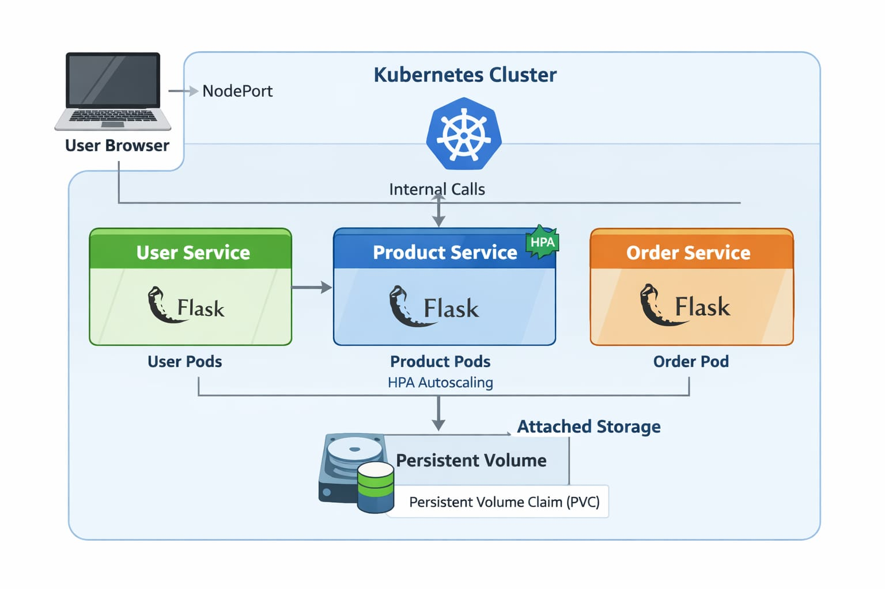
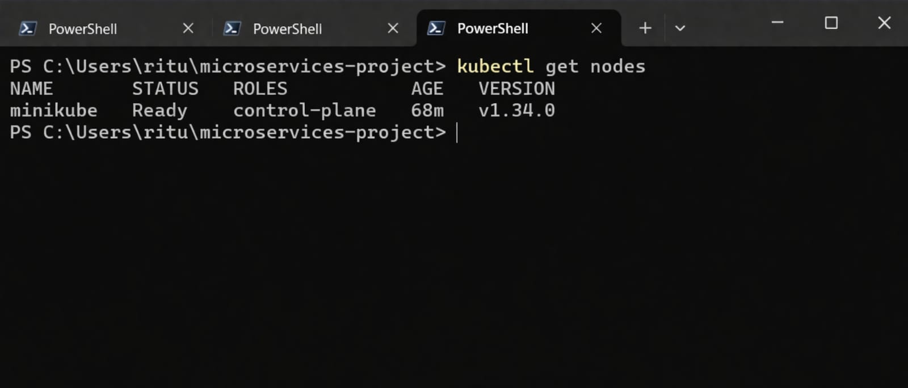
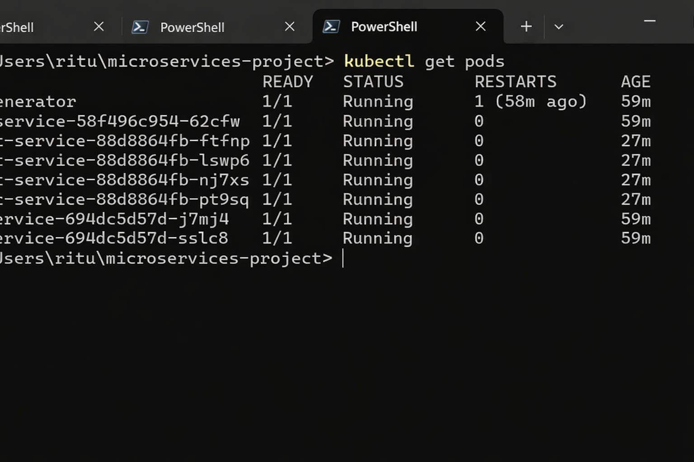
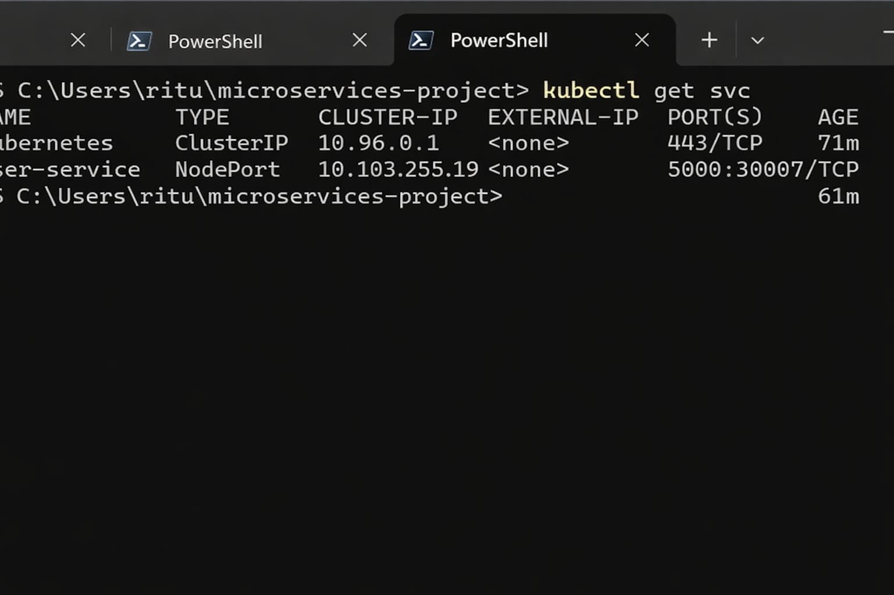
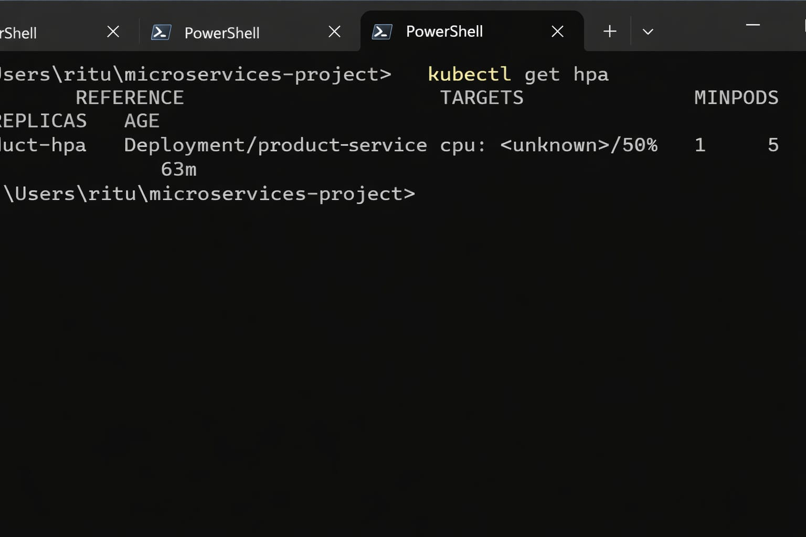
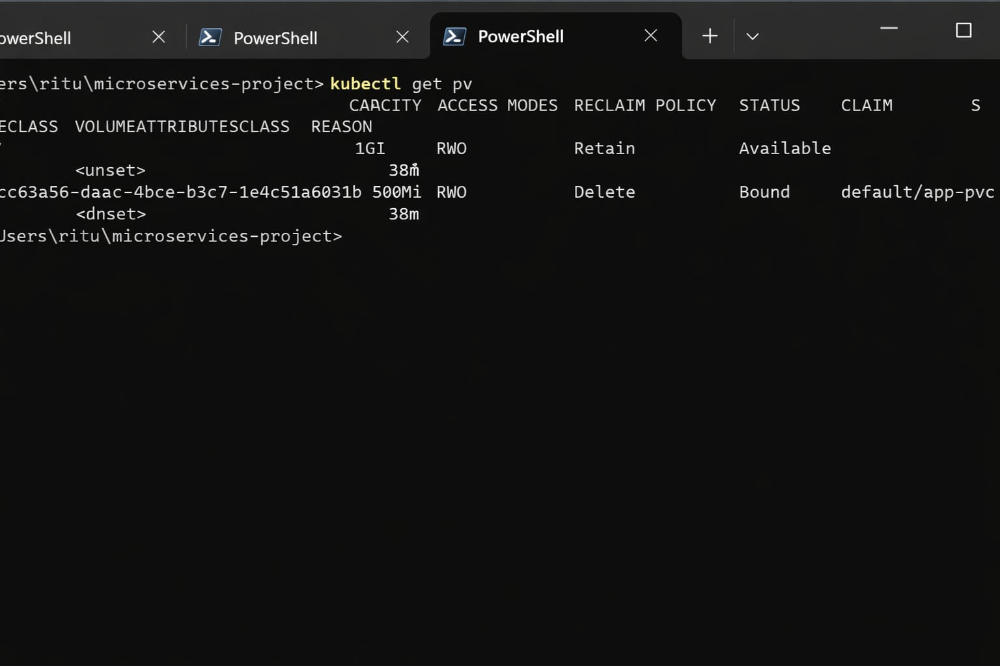
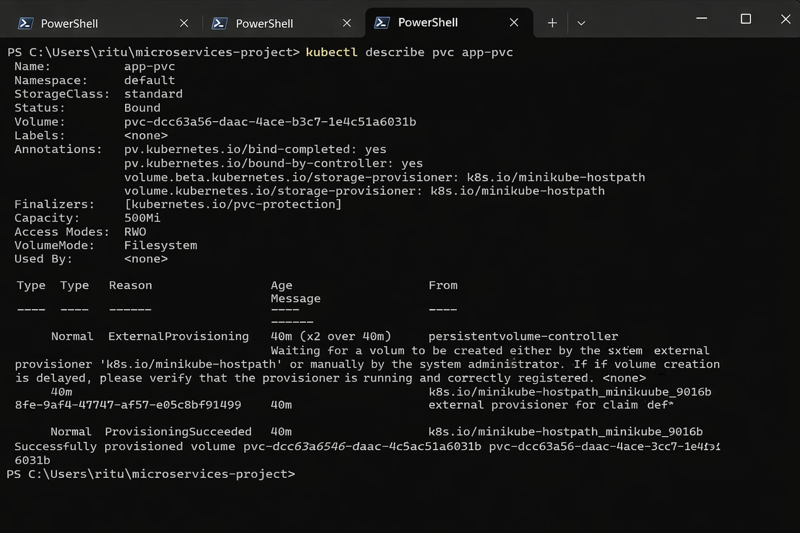

# Deploying-and-Managing-Microservices-in-a-Cloud-Native-Environment

---

##  Project Overview

This project demonstrates how to containerize and deploy a microservices-based application using Kubernetes best practices.

The system is designed as part of a migration from a monolithic architecture to microservices to improve scalability, availability, and maintainability.

---

##  Architecture

```
User → Kubernetes Cluster → Microservices
                         → User Service
                         → Product Service
                         → Order Service
                         → Persistent Storage
```

---

##  Architecture Diagram



---

##  Technologies Used

- Kubernetes (Minikube / EKS / etc.)
-  Docker
-  Microservices (User, Product, Order)
-  Docker Hub (Container Registry)
-  Horizontal Pod Autoscaler (HPA)
-  Persistent Volume (PV & PVC)

---

##  Implementation Steps

---

###  1. Kubernetes Setup

- Installed Minikube / Cloud Kubernetes Cluster  
- Configured kubectl  

```bash
kubectl get nodes
```

 Screenshot:



---

###  2. Containerization (Docker)

Each microservice has its own Dockerfile.

#### Example Dockerfile (User Service)

```dockerfile
FROM python:3.9
WORKDIR /app
COPY . .
RUN pip install flask
CMD ["python", "app.py"]
```

#### Built Images

- user-service:latest  
- product-service:latest  
- order-service:latest  

```bash
docker build -t user-service .
docker build -t product-service .
docker build -t order-service .
```

---

##  Kubernetes Deployments

Each service is deployed using Kubernetes Deployment YAML.

### Example: User Service Deployment

```yaml
apiVersion: apps/v1
kind: Deployment
metadata:
  name: user-service
spec:
  replicas: 2
  selector:
    matchLabels:
      app: user-service
  template:
    metadata:
      labels:
        app: user-service
    spec:
      containers:
      - name: user-service
        image: user-service:latest
        ports:
        - containerPort: 5000
```

 Pods Screenshot:



---

##  Services (Service Discovery & Load Balancing)

- **ClusterIP** → Internal communication  
- **NodePort** → External access  

### Example Service YAML

```yaml
apiVersion: v1
kind: Service
metadata:
  name: user-service
spec:
  type: NodePort
  selector:
    app: user-service
  ports:
    - port: 80
      targetPort: 5000
      nodePort: 30007
```

 Services Screenshot:



---

##  Horizontal Pod Autoscaler (HPA)

Configured HPA for **Product Service** based on CPU usage.

```bash
kubectl autoscale deployment product-service --cpu-percent=50 --min=1 --max=5
```

 HPA Screenshot:



---

##  Load Testing

```bash
while true; do curl http://<node-ip>:30007; done
```

Check scaling:

```bash
kubectl get hpa
```

---

##  Persistent Storage (PV & PVC)

Created Persistent Volume and Persistent Volume Claim for Order Service.

### PVC YAML

```yaml
apiVersion: v1
kind: PersistentVolumeClaim
metadata:
  name: order-pvc
spec:
  accessModes:
    - ReadWriteOnce
  resources:
    requests:
      storage: 1Gi
```

 PVC Screenshot:



 PVC Details:



---

##  Data Persistence

- Order Service stores data in mounted volume  
- Data remains even after pod restart 

---

##  Outputs

###  User Service Output


---

###  Product Service Output


---

###  Order Service Output


---

##  Testing

- Verified all services are running  
- Checked internal communication via ClusterIP  
- Accessed services externally using NodePort  
- Tested autoscaling under load  
- Verified persistent storage  

---

##  Challenges & Solutions

| Challenge | Solution |
|----------|----------|
| Pods not starting | Checked logs using `kubectl logs` |
| Service not accessible | Verified NodePort and firewall |
| HPA not scaling | Installed metrics-server |
| Data loss issue | Implemented PVC |

---

##  Conclusion

Successfully:

- Deployed microservices using Kubernetes  
- Implemented service discovery & load balancing  
- Configured autoscaling (HPA)  
- Enabled persistent storage using PVC  

This project demonstrates real-world cloud-native deployment practices.

---

##  Author

#### Ritu Patil

---
